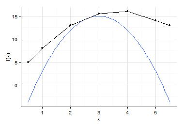
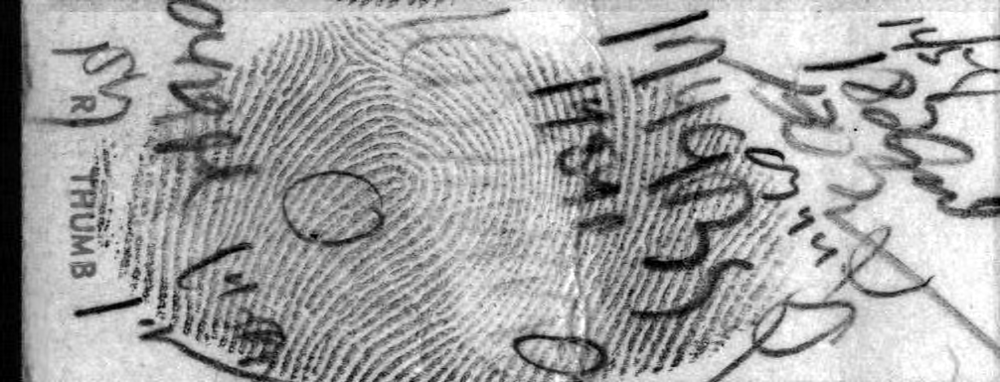

<section id="intro">
    	<header>
    		<h2>MGLM</h2>
        </header>
        
Multivariate count data abound in modern application areas such as genomics, sports, imaging analysis, 
		and text mining.  Because of the complex structure of the data, the popular multinomial logit model might 
		not be sufficient. The R package MGLM and matlab toolbox mglm provide functions that fit distributions, run 
		regression and penalized regression on the multivariate count data.  Implementations of multinomial logit model, 
		Dirichlet multinomial model, generalized Dirichlet multinomial model, and negative multinomial models can be 
		found in this package. Making the best of both the MM algorithm and the Newton Raphson method, we derive stable and 
		efficient algorithms to find the maximum likelihood estimates.  If running on a multi-core machine, 
		multi-threading operations are enabled.

        <a href="http://cran.r-project.org/web/packages/MGLM/">Donwload R package</a>
		<a href="http://www4.stat.ncsu.edu/~hzhou3/softwares/mglm/">Donwload matlab toolbox</a>
        

        	

            	
            

        

    </section>
	<section id="intro">
    	<header>
    		<h2>correlogram</h2>
        </header>
        
In movies, whenever a criminal's finger print is found, he is done.  The policeman will 
		magically find this person in their database in an eye blink.  I was sad to learn that this is no more than
		a fantasy created by the directors.  It is much harder and time consuming to match the finger print found 
		in the criminal scene with those in the database.  This particular R package is used to match finger print
		data utilizing the grascale and the pixel location information.

		
The package can also be used for other image processing problems, such as image categorization. 

        <a href="/">Donwload R package</a>
        

        	

            	
            

        

    </section>